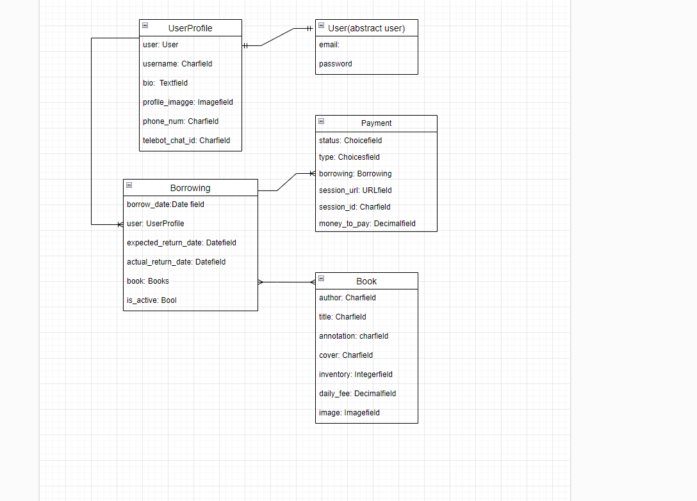

# DRF-Library-API

This repository contains a REST API built with Python Django and Django REST Framework.
It allows users to create an account, log in, and perform CRUD (Create, Read, Update, Delete) operations
on user profile, books,  borrowing books, pay for borrowing (STRIPE payment system) and send info message to telegram bot


In addition, the status of borrowings is checked once a day,
and a message about the expiration of the borrowing period or
its absence is sent via Telegram bot.

## Installation

Python must be already installed.\
Clone this repository to your local machine\
[DRF_Library_API can be downloaded from:](https://github.com/roma-mechanic/DRF-Library-API.git)\
Or\
git clone https://github.com/roma-mechanic/DRF-Library-API.git

### How to run with Docker:

Important ! Docker, Docker Desktop must be already installed

- Create and fill in the .env file with user data according to the .env_sample file.
- Run app

```bash
docker-compose up --build
```

- Create admin user.

```bash
docker exec -it <container ID> python manage.py createsuperuser
```

- Create / get JWT-token and authorization.
- Create your User Profile
- Create account/register on STRIPE payment system and get STRIPE_SECRET_KEY, STRIPE_PUBLISHABLE_KEY from it.
- Create a new bot to receive messages in TELEGRAM through "BotFather" and get your TELEGRAM_TOKEN or connect to an existing one if the bot is already created and get your CHAT_ID. 
- Add in the .env file new data.
- Use borrowings application.
- All endpoints in swagger documentation 127.0.0.1.8000/api/doc/swagger/

## Project scheme


## Demo swagger scheme endpoints
